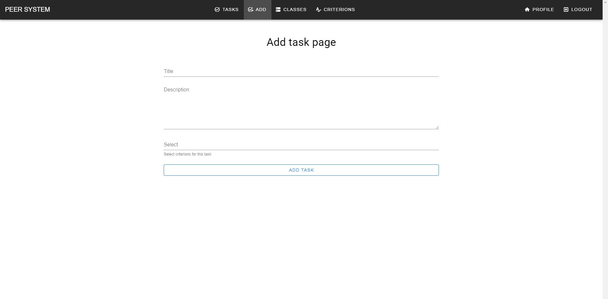

# Добавление новой задачи

Страница добавления новой задачи

**Router** : `/add`

**Methods** : `GET, POST`

**Description**

Интерфейс позволяет учителю добавлять новые задачи для учеников.

**Screenshot**
