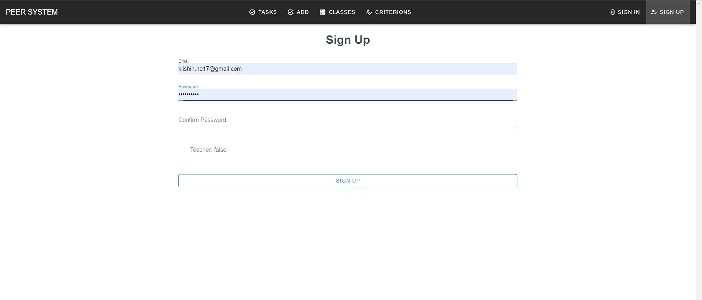

# Регистрация нового пользователя в системе

Страница регистрации нового пользователя в системе

**Router** : `/register`

**Methods** : `GET, POST`

**Description**

Данный интерфейс позволяет зарегистрироваться новым пользователям в системе. При регистрации необходимо указать уникальный адресс почты и пароль. Так же необходимо указать являетесь ли вы учителем или учеником.

**Screenshot**

