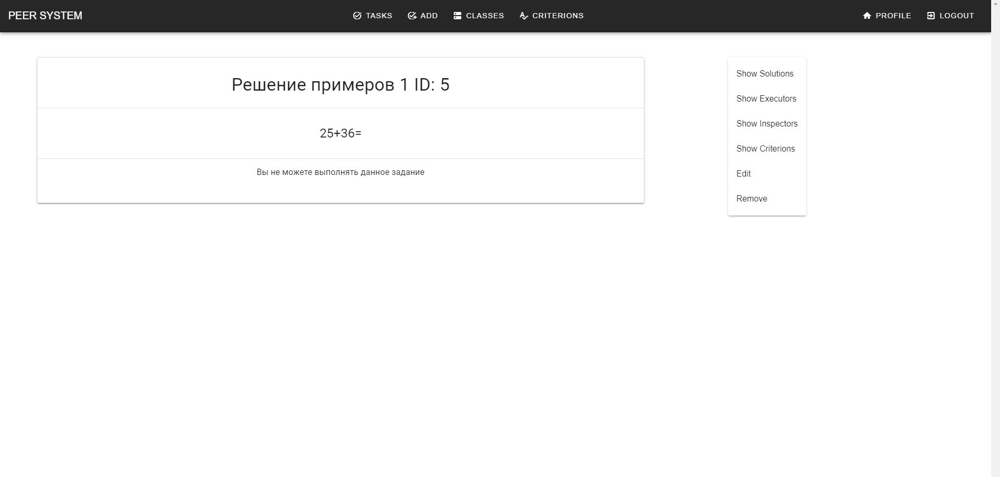

# Задача

Страница отбражения профиля пользователя

**Router** : `/profile`

**Methods** : `GET, POST`

**Description**

Интерфейс предоставляет возможность работы с выбранной задачей
В зависимости от типа пользователя интерфейс предоставляет различные инструменты для работы

* Для всех пользователей:
    - Просмотр информации о задачи и ее описания
    - Просмотр указанных критериев для оценки задачи
    - Просмотр исполнителей задачи
    - Просмотр проверяющих задачи
    - Просмотр существующих решений задачи
* Для учителя, создавшего задачу:
    - Редактирование основной информации о задаче
    - Назначение и удаление исполнителей задачи
    - Назначение и удаление проверяющих задачи
    - Удаление задачи
* Для ученика, назначенного испонителем задачи:
    - Добавление своего решения задачи
    - Просмотр оценок решений задачи
* Для ученика, назначенного проверяющим задачи:
    - Добавление оценок решений испонителей задачи

**Screenshot**
